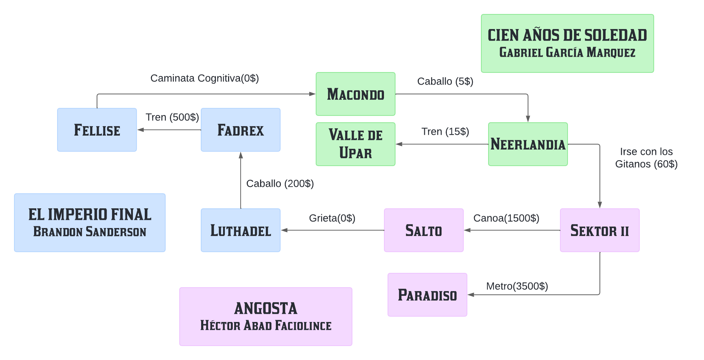

# 🦉Teoría de Lenguajes de Programación.

### Integrantes:
- ***Jimena Hernández Castillo*** TI.1022094340 Grupo 3.
- ***Juan Esteban Arango Zapata*** CC.1018230863 Grupo 3.
### ***Universiad Nacional de Colombia.***


## Actividad 1: Virtual Programming Laboratory
A lo largo del presente repositorio pretendemos dar solución a los diversos problemas propuestos en el VPL de TLP.

### 💻Ejercicio 1: Rutinas recursivas
#### A) Conteo
```prolog
contar([1, 2, 3, 4], Conteo).
```
#### B) Remover
```prolog
remover(2, [1, 2, 3, 4], Nueva_lista).
```
#### C) Potencia
```prolog
potencia(2, 4, Respuesta1).
potencia(3, -1, Respuesta2).
```
### 💻Ejercicio 2: Invertir un número
```prolog
invertir(123456789, Invertido).
```
### 💻Ejercicio 3: Viajeros
Adjuntamos aquí de manera gráfica la base de conocimientos que establecimos para el problema.


<p align="center">

</p>

Para hacer una consulta en este caso se usaría por ejemplo:

```prolog
enrutar('Macondo', 'Sektor II', Recorrido, Precio_trayectos, Precio_total, Tipos_transporte).
```
### 💻Ejercicio 4: Cuadrado Mágico
```prolog
mostrarCuadradoMagico.
```
### 💻Ejercicio 5: Hugo, Paco y Luis.
En este ejercicio nos tomamos la libertad de realizar dos soluciones distintas para el mismo problema.
```prolog
respuesta_jime.
respuesta_juanes.
```

### ✨ ¡¡¡Muchas gracias por su atención!!!
Hasta el próximo VPL.

